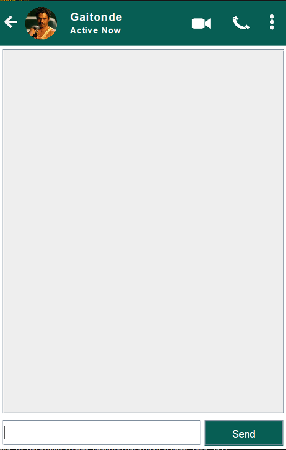
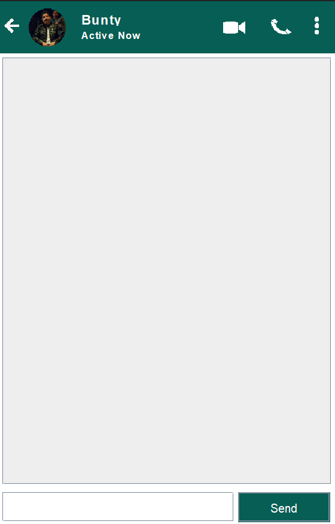
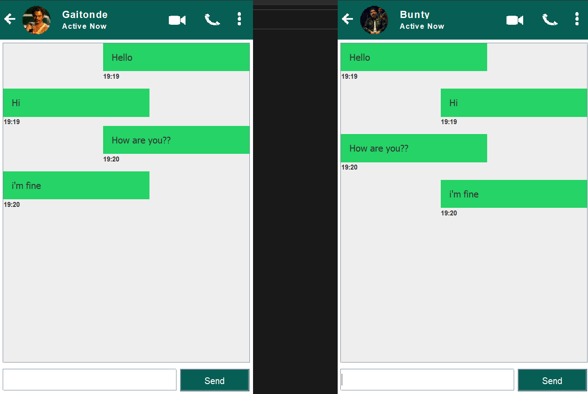

# Chatting Application

# ScreenShots

  
   
  <b>Server Interface:</b> This is a screenshot of the Server interface.

 

  
   
  <b>Client Interface:</b> This is a screenshot of the Client interface.

 

  
   
  <b>Conversation:</b> This is a screenshot showing a conversation between the Server and Client.

# Description
This project is a simple Chatting Application implemented using Java Swing. It consists of two main components - the Server and the Client, allowing two users to exchange messages in real-time. The graphical user interface (GUI) is designed using Java Swing components, providing an interactive chat experience.

# Features
* Real-time communication between a Server and a Client.
* User-friendly GUI with a message display area and a text input field.
* Messages are displayed with timestamps.
* Option to exit the application gracefully.
# How to Use
* Compile and run the Server.java on one machine. It will start listening for incoming connections.
* Compile and run the Client.java on another machine. The Client will connect to the Server.
* The Server and Client GUI windows will open, and users can start sending messages to each other.
* Type your message in the text input field at the bottom and click "Send" or press the Enter key to send the message.
* Messages are displayed with the sender's name, message content, and timestamp.
* To exit the application, click the "<-" button on the top-right corner of the window or press the "Close" button on the Server window.

# Dependencies
* Java Development Kit (JDK)
* Java Swing library for GUI components
  
# Running the Application
* Compile both Server.java and Client.java files using the Java compiler:
To Compile Server: `javac Server.java`
To Compile Client: `javac Client.java`
* Start the Server on one machine:
  To run Server: `java Server`
* Start the Client on another machine:
  To run Client: `java Client`

